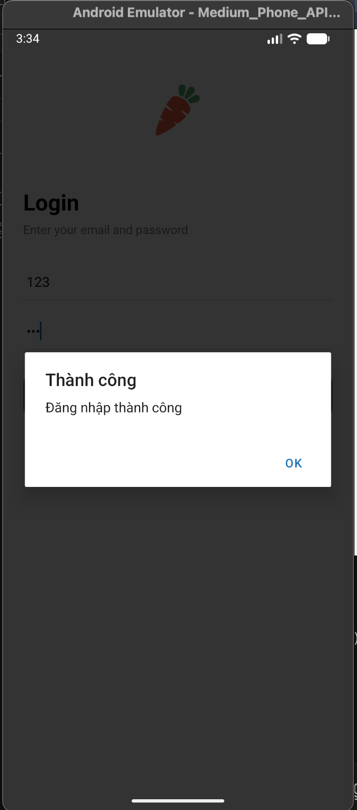

# Nguyễn Nhật Mai_23810310266

<video controls src="Demo-Nguyễn Nhật Mai_23810310266.mov" title="Title"></video>

1. Mô tả chức năng
Xác thực người dùng: Đăng ký, đăng nhập và lưu trạng thái đăng nhập
Xem sản phẩm: Hiển thị danh sách sản phẩm theo danh mục
Tìm kiếm & lọc: Tìm kiếm sản phẩm theo tên và lọc theo категории, thương hiệu
Giỏ hàng: Thêm, xoá, cập nhật số lượng sản phẩm
Thanh toán: Đặt hàng và hiển thị trạng thái đơn hàng
Quản lý đơn hàng: Xem danh sách đơn đã đặt, xoá đơn
Yêu thích: Lưu sản phẩm yêu thích

2. Hướng dẫn chạy ứng dụng
Các bước thực hiện:
Cài đặt thư viện:
npm install
Chạy ứng dụng:
npx expo start
Mở app:
Dùng Expo Go để quét QR trên điện thoại